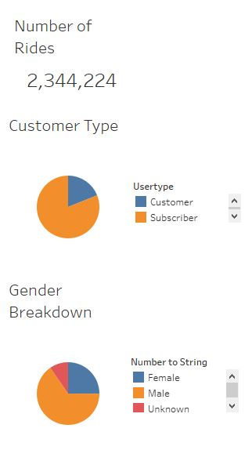
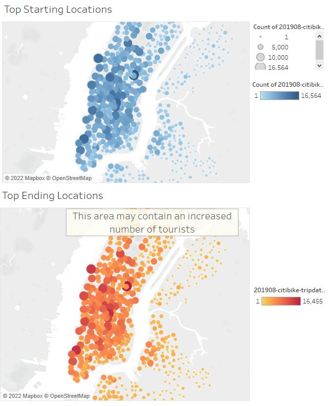
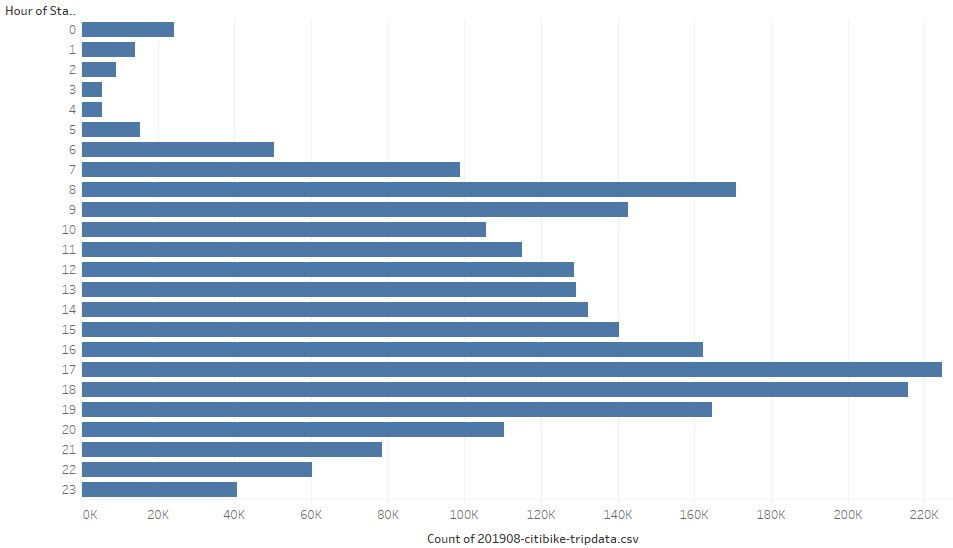
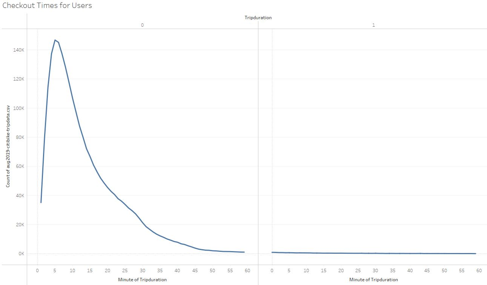
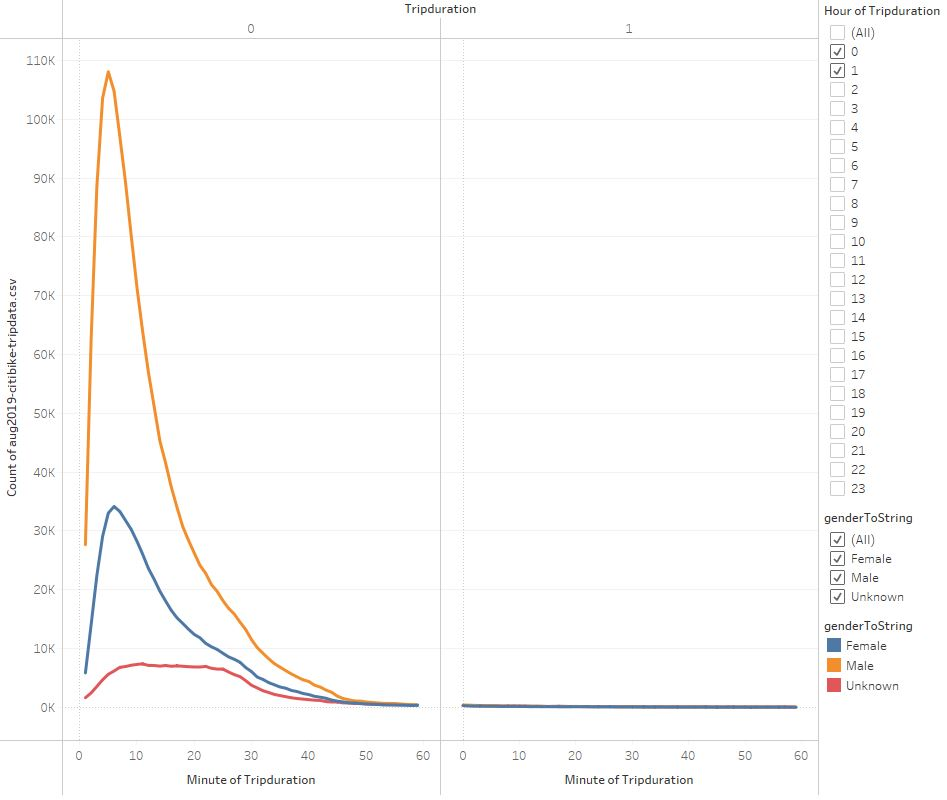
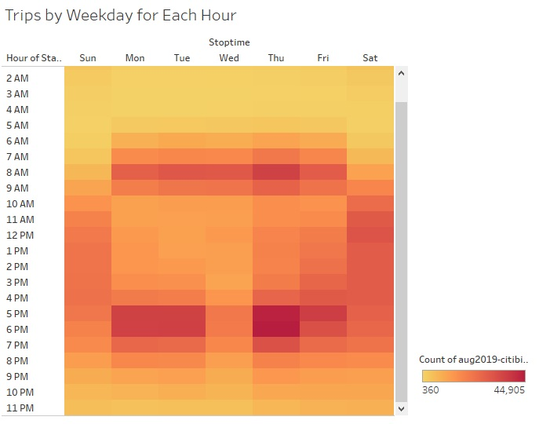
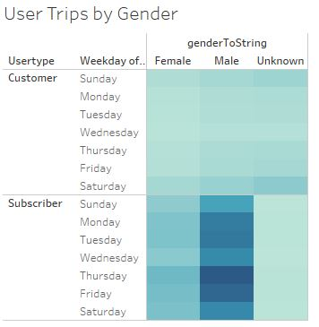

# bikesharing

## Overview

### Purpose

The purpose of this analysis is to assess the user data for Citibike in New York City in order to determine the viability of implmenting the system in Des Moines, Iowa.

## Results

The full set of visualizations for the analysis can be found at the following link: [Citibike_Analysis](https://public.tableau.com/app/profile/ed8754/viz/Citibike_Analysis_16523228586560/CitibikeAnalysis)

### User breakdown

The data suggest that a majority of riders are subscribers to the program, indicating that most users probably live locally and use the bike-sharing system on a regular basis.  The remainder of users are likley a blend between locals and tourists, using the system on an as-needed basis.

### Start vs. Finish

The data suggest that the majority of starting and finishing locations reside in Manhattan.  Given that the majority of users are regular subscribers, this suggests that the primary use of the bike-sharing system is for local commuting.

### Hour of Start

The data for which time of day most trips begin on provide further evidence that there are peaks of activity during the morning and evening commute.  The added activity over the course of the day suggests that ride activity increases from individuals who aren't using the system for commuting, ultimately leading to the evening where the data would suggest that the peak usage is a blend of commuters and those partaking in social outings.

### Trip Duration

The data indicate that the vast majority of trips conclude within an hour of a bike being checked out. This further supports that the typical usage is for short, commuter-style trips and that users aren't using the bikes for long-distance travel.

Breaking down trip duration by gender shows that there does not appear to be much difference in overall trip duration between genders.

### Weekday Trips

The breakdown of data for when trips start based on time and day of the week further indicate that the peak time for users is during the commuting hours of the weekday.

Breaking down the data further by gender provides additional clear insight that males prefer the Citibike system as a commuter tool versus females.

Breaking down the data further to discern between regular subscribers and single-use customers shows that the use of the system as a commuter tool by males is where the bulk of revenue can be found for implementing this system.

## Summary

### Conclusions

Based on the NYC data for Citibike, the implementation of a bikeshare system in another city should be focused heavily on making sure the system is set up to serve as a commuter system for local individuals.  While some revenue will still be gained by tourists and non-commuters, the bulk of the revenue should be planned to come from commuters.  The data further suggest that the target demographic should be working males who reside within a 40-minute bike ride from their place of business.

### Recommendations

In order to gain deeper insight, future visualizations should seek to break down what factors drive bikeshare locations to have higher popularity than others.  This would help to determine which areas in a new city would provide the most revenue if it can be demonstrated that popular locations specifically located near areas that are dense with housing are most successful when complemented by share locations that are near areas dense with worksites.

Another beneficial visualization would be to view changes in user behavior over the course of the year to see whether or not the weather has a direct impact on total ridership.